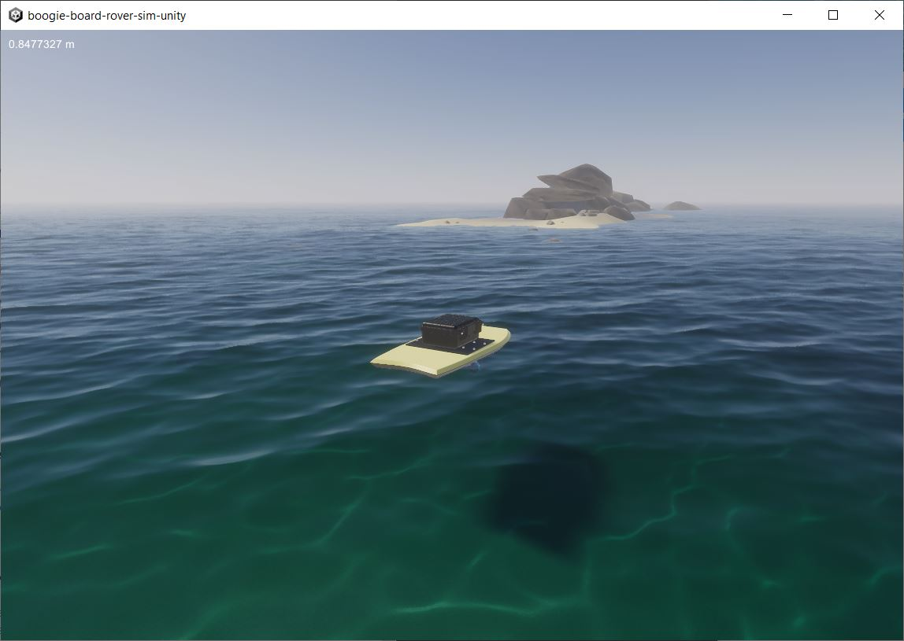

# Unity ArduBoat Simulator

Unity simulation of ArduRover boogie board boat. Uses the ArduPilot JSON API to interface with [ArduPilot SITL](https://ardupilot.org/dev/docs/sitl-simulator-software-in-the-loop.html).

This is a digital twin to a real rover I built at https://github.com/chrisdalke/boogie-board-rover.

## Usage

The unity program connects to an ArduPilot SITL using the ArduPilot JSON interface: https://ardupilot.org/dev/docs/sitl-with-JSON.html

For documentation on the ArduPilot JSON API, see: https://github.com/ArduPilot/ardupilot/tree/master/libraries/SITL/examples/JSON

To start the simulator:

1. Start ArduPilot's `sim_vehicle.py`, either by following the ArduPilot docs, or using my bundled script by running `docker-compose up` in the `ArduPilot/` folder.
2. Start the Unity simulator by running `Build/boogie-board-rover-sim-unity.exe`
3. Open QGroundControl, and connect to ArduPilot as normal.
4. Start a mission!

## Controls

- Click + Drag to orbit the camera
- Mouse wheel to zoom in/out
- R to reset the scene

## Limitations

- The sim is very sensitive to startup order, you might have to play around with timing of when you start the ardupilot script and Unity program to get it to work.
- Accelerations are not reported; this does not seem to trip up ArduRover but might break other projects.
- You may need to manually configure your ArduPilot SITL to use ArduRover and differential drive.